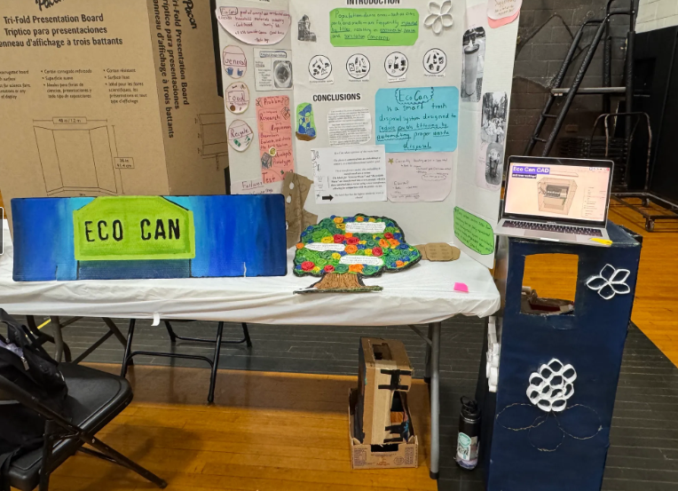

project from 2023-2024
## Context 
This project was made to be integrated with an engineering project of mine called EcoCan. The goal for this project was to reduce mislabeled trash waste (that ends up being harmful to the enviroment) by automating how trash is organized. I created a prototype of this idea by using webcam, and cardboard. The overall design is the same as a trash bucket. The code in this repo is for the web cam programming part. 


Here is how the project looked:



If you're interested in seeing the basic CAD design, see the link below. 

[EcoCan CAD Design (Onshape)](https://cad.onshape.com/documents/c499a516d8a37d2e17f9c6dc/w/86c057b2d0b42443cf14b16d/e/2c88284a04df373331d24175?renderMode=0&uiState=69b9c80608bdac9d4eabaa18)


# EcoCan Recognition

A Python project for classifying waste/material categories (`plastic`, `wood`, `metal`, `food`, `electronics`, `other`) using an opensource CLIP model.

This repo currently includes three scripts:
- `main.py`: runs CLIP locally (Transformers + PyTorch) on webcam frames.
- `api.py`: sends one image to the Hugging Face Inference API.
- `cam.py`: captures webcam frames and classifies them via the Hugging Face Inference API.

## Features

- Real-time webcam capture with OpenCV.
- Classification with CLIP (`openai/clip-vit-base-patch16`).
- Two inference modes:
  - Local model inference (`main.py`)
  - Hosted API inference (`api.py`, `cam.py`)

## Requirements

- Python 3.9+
- Webcam connected and accessible
- Internet connection (for `api.py` and `cam.py`, and first-time CLIP model download)

## Installation

1. Clone this repository and enter it.
2. Create and activate a virtual environment.
3. Install dependencies:

```bash
pip install opencv-python pillow transformers torch python-dotenv requests pyfirmata
```

## Environment Variables (API Scripts)

For `api.py` and `cam.py`, create a `.env` file in the project root:

```env
HUGGINGFACE_API_TOKEN=your_huggingface_token_here
```

## How To Run

### 1) Local webcam classification

Runs CLIP locally on your machine:

```bash
python main.py
```

### 2) Single-image API classification

Make sure an image named `bottle.jpg` exists in the project root (or update the path in `api.py`), then run:

```bash
python api.py
```

### 3) Webcam API classification

Captures webcam frames and sends an image about every 5 seconds:

```bash
python cam.py
```

Press `q` in the webcam window to exit.

## Output

Each script prints predicted labels and confidence scores/probabilities in the terminal.

## Notes

- The first run of `main.py` may take longer while model files are downloaded.
- `cam.py` saves a temporary image file (`temp_image.jpg`) during processing.
- `pyfirmata` is imported in `main.py` but not yet used in the current script logic.

## Troubleshooting

- `Cannot open webcam`: check camera permissions and ensure no other app is using the camera.
- Authentication/API errors: verify `HUGGINGFACE_API_TOKEN` in `.env`.
- Slow inference: local CLIP on CPU can be slow; GPU support depends on your PyTorch installation.
